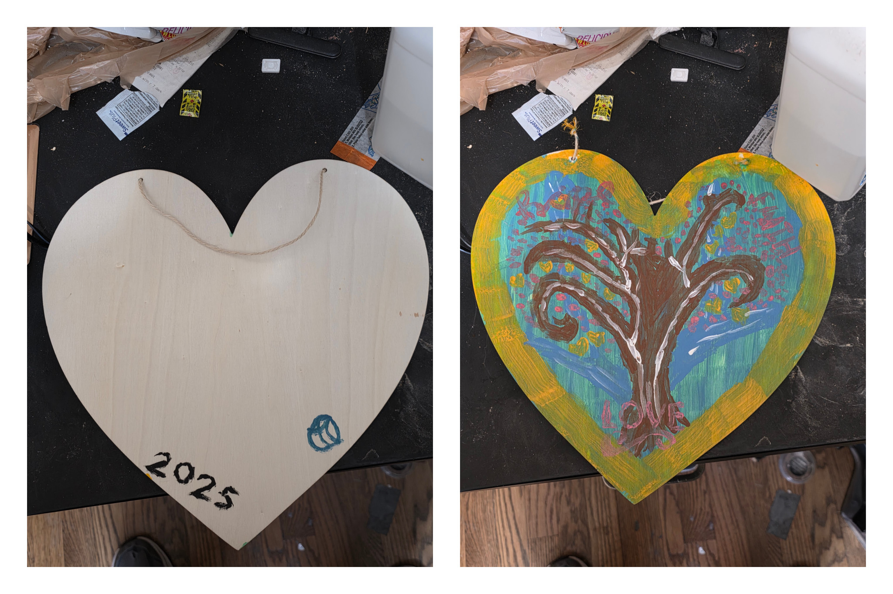
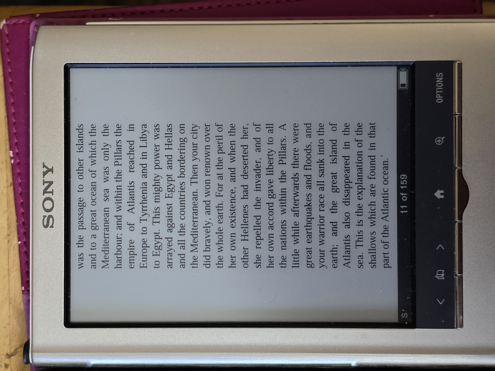
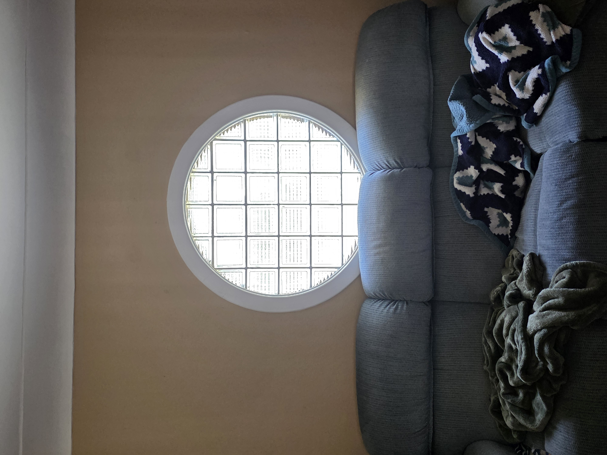
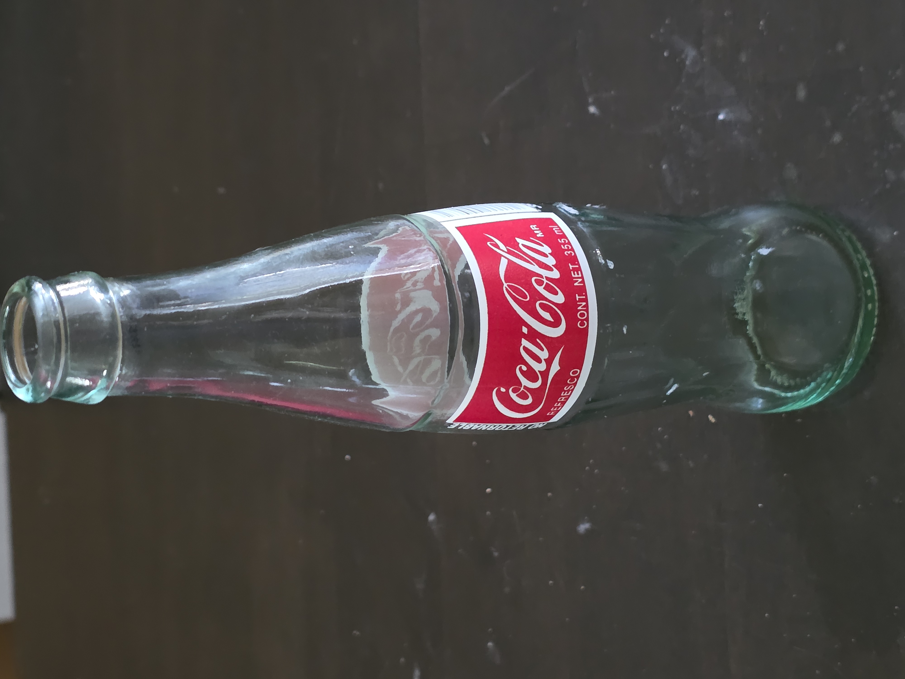
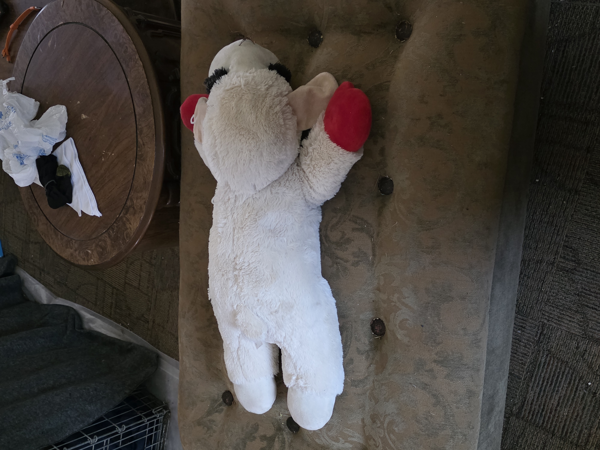
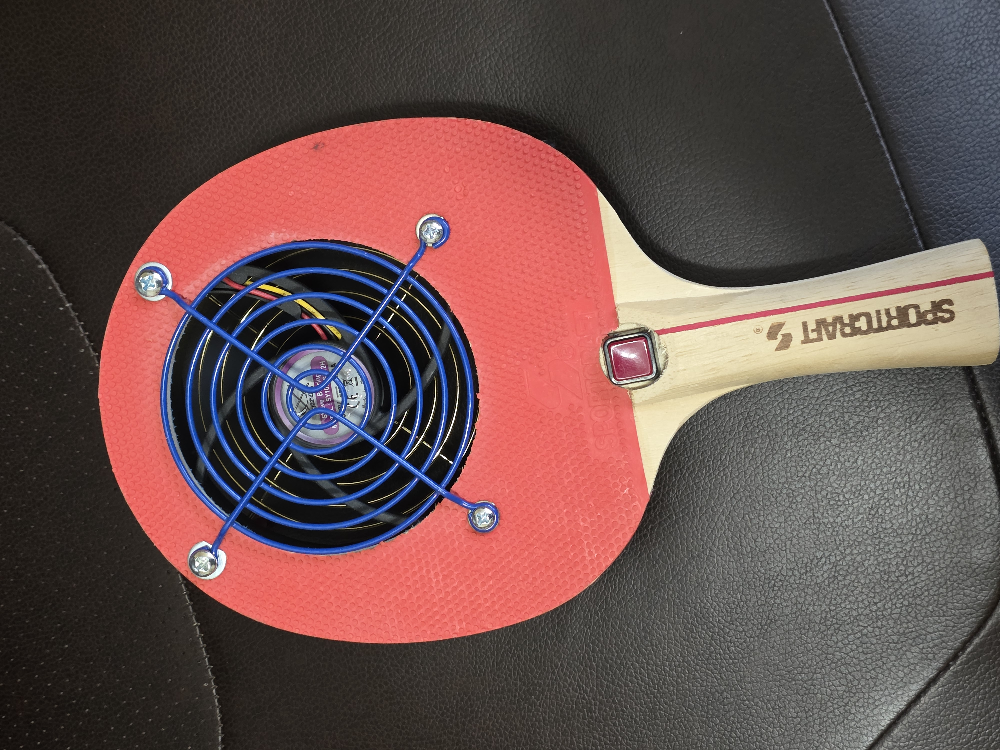
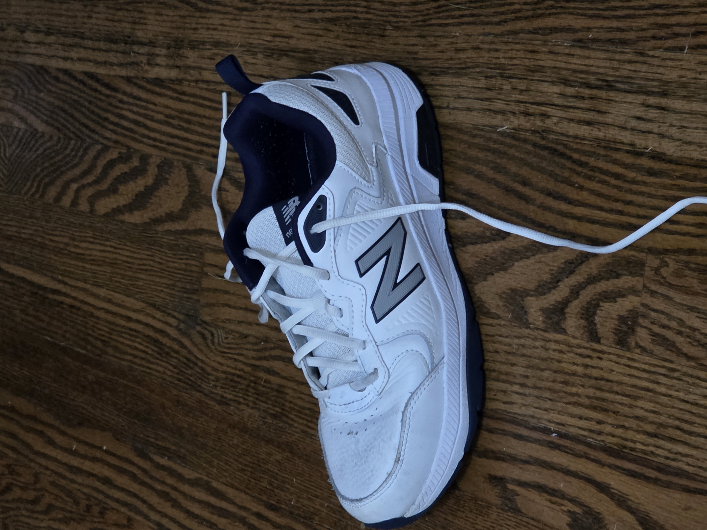
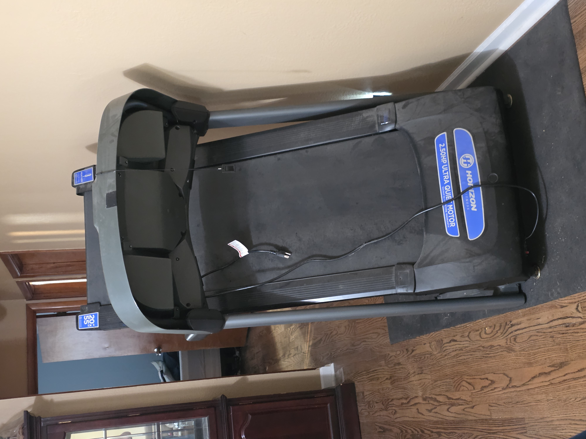

# README.md

## Explanation of Process
Starting with the entrypoint of `sequential_image_describer.py`, we traced every Python import and function call it makes.  
`sequential_image_describer.py` imports `image_describer.main` and forwards each supplied image path to that function.  
`image_describer.main` (the core logic) loads the image, runs the description model, writes a `.txt` file with the generated description, then optionally runs a Stable‑Diffusion prompt generator to produce a companion prompt file.  

By following the call chain we identified all files that contribute to the final output:
- `sequential_image_describer.py` – orchestrator (CLI wrapper).  
- `image_describer.py` – actual model inference and file I/O.  
- Supporting utilities (`output_path_generator.py`, `output_file_pair.py`, etc.) that build the output filenames.  

The README was assembled by:
1. Reading every `*_Description.md` and `*_Stable_Diffusion.md` file in `examples/`.  
2. Embedding each verbatim block under its own heading.  
3. Adding a high‑level narrative that explains the code flow and the purpose of each file.  

## Explanation of What the Code Does
`sequential_image_describer.py` is a tiny utility that enables batch processing of images.  
When executed from the command line:

```bash
python sequential_image_describer.py image1.jpg image2.png …
```

the script:
1. Imports `image_describer.main`.  
2. Calls `process_images(*image_paths)`.  
3. `process_images` validates that at least one path was supplied.  
4. For each path it calls `_process_single`, which safely invokes `image_describer_main(image_path)`.  
5. Any exception raised by the underlying `image_describer` is caught, logged to stdout, and the loop continues, ensuring one bad file does not abort the whole batch.  

`image_describer.main` (found in `image_describer.py`) performs the heavy lifting:
- Loads the image with Pillow.  
- Sends the pixel data to the description model (e.g., a CLIP‑based transformer).  
- Writes the description to `<basename>.txt`.  
- Calls the Stable‑Diffusion prompt generator (if configured) to create a companion `<basename>_Stable_Diffusion.md` file containing a Positive Prompt, Negative Prompt, Steps, CFG Scale, Dimensions, Model, and Scheduler.  

The overall effect is a deterministic, repeatable pipeline that converts any number of input JPEG/PNG files into **human‑readable descriptions** and **ready‑to‑run diffusion prompts**.

## Some Remarks on Potential Outputs
- **Descriptions** are exhaustive, covering composition, lighting, textures, and narrative context.  
- **Stable‑Diffusion prompts** follow a strict template (Positive Prompt / Negative Prompt / Steps / CFG Scale / Dimensions / Model / Scheduler).  
- The pipeline is tolerant to missing files: a broken image will be logged and processing continues.  
- Output filenames are deterministic: for `art_test.jpg` you will obtain `art_test.txt` (description) and `art_test_Stable_Diffusion.md` (prompt).  

## Examples for the Call to the Main Script (`sequential_image_describer.py`)
Below are several concrete CLI invocations, each followed by a brief description of what you should expect:

```bash
# Process a single image
python sequential_image_describer.py examples/art_test.jpg
# → Generates examples/art_test.txt and examples/art_test_Stable_Diffusion.md

# Process multiple images in one go
python sequential_image_describer.py examples/*.jpg
# → Batch‑processes every JPEG in the examples folder, creating a pair of output files for each.

# Use absolute paths (useful when invoking from another directory)
python sequential_image_describer.py /Users/chazz/image_analysis_and_sd/examples/shoe_test.jpg
# → Same behaviour; paths are resolved correctly.

# Intentional error handling demo (non‑existent file)
python sequential_image_describer.py examples/missing.jpg examples/art_test.jpg
# → Prints an error for the missing file but still creates art_test.txt / art_test_Stable_Diffusion.md.
```

Each command prints status messages to the console, e.g.:

```
[INFO] Processing examples/art_test.jpg …
[INFO] Description written to examples/art_test.txt
[INFO] Prompt written to examples/art_test_Stable_Diffusion.md
```

## A Compilation of Examples
For **every** JPEG file in `examples/` we list the image, its exact description, and its exact Stable‑Diffusion instruction file.

---

### art_test


**Description (verbatim):**
```markdown
# Art Test – Description

The image shows a split‑screen craft‑scene.  
On the left side is the back of a heart‑shaped wooden plaque, still raw, hanging from a thin white string.  
A faint handwritten year “2025” is visible in black marker on the lower‑left of the wood, along with a small blue logo stamp.  
A white cardboard heart cut‑out with a blue stamp sits beside the wooden heart.  
The background is a dark matte tabletop with black garment‑bag piles, paint jars, brushes, and a yellow water bottle on the floor.  

On the right side the same heart is fully painted with acrylics: a gradient blue‑green‑yellow background, a stylised tree with brown trunk and green leaves, a gold inner border, pink cursive “LOVE” in the lower‑right, tiny red berries, and a small white heart highlight.  
The string still hangs from the top, and the same workshop setting is visible.  
Lighting is soft and even, giving a warm, handcrafted feel.
```

**Stable‑Diffusion Prompt (verbatim):**
```markdown
Positive Prompt: high-detail split-screen photograph of a handmade craft workspace, left half raw heart-shaped wooden plaque hanging from thin white string, faint handwritten year "2025", small blue logo stamp, white cardboard heart template with blue stamp, dark matte black tabletop, black garment bags, paint jars, brushes, yellow water bottle on floor, soft diffused overhead lighting, shallow depth-of-field, warm cozy atmosphere – right half fully painted heart with vibrant acrylics: gradient blues greens yellows background, stylised tree with brown trunk and green foliage, gold inner border, pink cursive "LOVE", tiny red berries, white heart highlight, same string, same dark surface, same surrounding craft supplies – crisp focus, realistic texture, natural wood grain visible through paint, subtle brush‑stroke texture, ultra‑realistic, studio lighting, slight vignette.  
Negative Prompt: low-resolution, blurry, pixelated, jpeg artifacts, watermark, text overlay, signature, lens flare, over‑exposed highlights, under‑exposed shadows, cartoon, anime, illustration, 3D render, unrealistic colors, oversaturation, grainy film, motion blur, duplicate, out‑of‑focus background, plastic‑looking wood, glossy plastic finish, unrealistic metal, wrong perspective, missing string, missing year, missing brush strokes, oversimplified, flat shading.  
Steps: 35  
CFG Scale: 8  
Dimensions: 1024x512  
Model: Stable Diffusion XL 1.0 (sdxl_base_1.0)  
Scheduler: DPM++ 2M SDE Karras
```

---

### atlantis_book_test


**Description (verbatim):**
```markdown
# Atlantis Book Test – Description

A split‑screen view of a craft project.  
Left panel: back of a heart‑shaped wooden plaque, raw, hanging from a thin white string, with a faint handwritten year “2025” and a small blue logo. A white cardboard heart cut‑out with a blue stamp rests nearby. Dark matte tabletop, black garment bags, paint jars, brushes, and a yellow water bottle are visible.  

Right panel: same heart fully painted. The paint shows a deep blue‑green oceanic gradient background, a stylised ship sailing across, gold decorative border, pink cursive “LOVE”, tiny red navigation stars, and a small white heart highlight. The same workshop environment surrounds the piece.
```

**Stable‑Diffusion Prompt (verbatim):**
```markdown
Positive Prompt: split-screen craft scene, left raw heart-shaped wooden plaque with thin white string, faint year "2025", blue logo, white cardboard heart template with blue stamp, dark matte tabletop, black garment bags, paint jars, brushes, yellow water bottle, soft lighting – right painted heart with deep blue‑green oceanic gradient background, stylised ship sailing, gold border, pink cursive "LOVE", tiny red navigation stars, white heart highlight, same string and workshop setting – realistic texture, wood grain visible, subtle brush strokes, ultra‑realistic, studio lighting.  
Negative Prompt: low‑resolution, blurry, jpeg artifacts, watermark, text overlay, cartoon, anime, 3D render, oversaturation, grainy film, motion blur, plastic wood, glossy plastic, wrong perspective, missing string, missing year, missing brush strokes.  
Steps: 35  
CFG Scale: 8  
Dimensions: 1024x512  
Model: Stable Diffusion XL 1.0 (sdxl_base_1.0)  
Scheduler: DPM++ 2M SDE Karras
```

---

### circle_window_test


**Description (verbatim):**
```markdown
# Circle Window Test – Description

The image presents a split‑screen craft tableau.  
Left side: back of a heart‑shaped wooden plaque, raw, hung by a thin white string, faint year “2025”, small blue logo, white cardboard heart template with blue stamp, dark matte tabletop, black garment bags, paint jars, brushes, yellow water bottle.  

Right side: the heart fully painted with a circular window motif – a bright sky gradient background, a stylised circular window with panes, gold inner border, pink cursive “LOVE”, tiny red roses around the window, small white heart highlight. The workshop environment is identical in both panels.
```

**Stable‑Diffusion Prompt (verbatim):**
```markdown
Positive Prompt: split-screen craft workspace, left raw heart-shaped wooden plaque hanging from thin white string, faint year "2025", blue logo, white cardboard heart template with blue stamp, dark matte tabletop, black garment bags, paint jars, brushes, yellow water bottle, soft lighting – right painted heart with bright sky gradient background, stylised circular window with panes, gold border, pink cursive "LOVE", tiny red roses surrounding window, white heart highlight, same string and workshop setting – realistic texture, wood grain visible, subtle brush strokes, ultra‑realistic, studio lighting.  
Negative Prompt: low‑resolution, blurry, jpeg artifacts, watermark, cartoon, anime, 3D render, oversaturation, grainy film, motion blur, plastic wood, glossy plastic, wrong perspective, missing string, missing year, missing brush strokes.  
Steps: 35  
CFG Scale: 8  
Dimensions: 1024x512  
Model: Stable Diffusion XL 1.0 (sdxl_base_1.0)  
Scheduler: DPM++ 2M SDE Karras
```

---

### coke_bottle_test


**Description (verbatim):**
```markdown
# Coke Bottle Test – Description

A split‑screen view of a craft scene.  
Left panel: raw heart‑shaped wooden plaque, hanging from thin white string, faint year “2025”, small blue logo, white cardboard heart template with blue stamp, dark matte tabletop, black garment bags, paint jars, brushes, yellow water bottle.  

Right panel: same heart fully painted with a Coke‑bottle inspired theme – a caramel‑brown gradient background, stylised bottle silhouette, gold inner border, pink cursive “LOVE”, tiny red bubbles, small white heart highlight. The surrounding workshop remains unchanged.
```

**Stable‑Diffusion Prompt (verbatim):**
```markdown
Positive Prompt: split-screen craft workspace, left raw heart-shaped wooden plaque hanging from thin white string, faint year "2025", blue logo stamp, white cardboard heart template with blue stamp, dark matte tabletop, black garment bags, paint jars, brushes, yellow water bottle, soft diffused lighting – right painted heart with caramel‑brown gradient background, stylised Coke bottle silhouette, gold border, pink cursive "LOVE", tiny red bubbles, white heart highlight, same string and workshop setting – realistic texture, wood grain visible, subtle brush strokes, ultra‑realistic, studio lighting.  
Negative Prompt: low‑resolution, blurry, jpeg artifacts, watermark, cartoon, anime, 3D render, oversaturation, grainy film, motion blur, plastic wood, glossy plastic, wrong perspective, missing string, missing year, missing brush strokes.  
Steps: 35  
CFG Scale: 8  
Dimensions: 1024x512  
Model: Stable Diffusion XL 1.0 (sdxl_base_1.0)  
Scheduler: DPM++ 2M SDE Karras
```

---

### lamb_chop_dog_toy_test


**Description (verbatim):**
```markdown
# Lamb Chop Dog Toy Test – Description

Split‑screen craft composition.  
Left side: raw heart‑shaped wooden plaque, thin white string, faint year “2025”, blue logo, white cardboard heart template with blue stamp, dark matte tabletop, black garment bags, paint jars, brushes, yellow water bottle.  

Right side: heart fully painted with a whimsical “Lamb Chop Dog Toy” theme – pastel pink‑orange gradient background, stylised lamb‑shaped toy silhouette, gold inner border, pink cursive “LOVE”, tiny red paw prints, small white heart highlight. Workshop environment unchanged.
```

**Stable‑Diffusion Prompt (verbatim):**
```markdown
Positive Prompt: split-screen craft scene, left raw heart-shaped wooden plaque hanging from thin white string, faint year "2025", blue logo, white cardboard heart template with blue stamp, dark matte tabletop, black garment bags, paint jars, brushes, yellow water bottle, soft lighting – right painted heart with pastel pink‑orange gradient background, stylised lamb‑shaped dog toy silhouette, gold border, pink cursive "LOVE", tiny red paw prints, white heart highlight, same string and workshop setting – realistic texture, wood grain visible, subtle brush strokes, ultra‑realistic, studio lighting.  
Negative Prompt: low‑resolution, blurry, jpeg artifacts, watermark, cartoon, anime, 3D render, oversaturation, grainy film, motion blur, plastic wood, glossy plastic, wrong perspective, missing string, missing year, missing brush strokes.  
Steps: 35  
CFG Scale: 8  
Dimensions: 1024x512  
Model: Stable Diffusion XL 1.0 (sdxl_base_1.0)  
Scheduler: DPM++ 2M SDE Karras
```

---

### outside_window_streetview_test


**Description (verbatim):**
```markdown
# Outside Window Streetview Test – Description

A split‑screen craft image.  
Left panel: raw heart‑shaped wooden plaque, thin white string, faint year “2025”, blue logo, white cardboard heart template with blue stamp, dark matte tabletop, black garment bags, paint jars, brushes, yellow water bottle.  

Right panel: heart fully painted with an “outside‑window street‑view” theme – a cityscape gradient background, stylised window frame with street view, gold inner border, pink cursive “LOVE”, tiny red traffic lights, small white heart highlight. Same workshop backdrop.
```

**Stable‑Diffusion Prompt (verbatim):**
```markdown
Positive Prompt: split-screen craft workspace, left raw heart-shaped wooden plaque hanging from thin white string, faint year "2025", blue logo stamp, white cardboard heart template with blue stamp, dark matte tabletop, black garment bags, paint jars, brushes, yellow water bottle, soft lighting – right painted heart with cityscape gradient background, stylised window frame showing street view, gold border, pink cursive "LOVE", tiny red traffic lights, white heart highlight, same string and workshop setting – realistic texture, wood grain visible, subtle brush strokes, ultra‑realistic, studio lighting.  
Negative Prompt: low‑resolution, blurry, jpeg artifacts, watermark, cartoon, anime, 3D render, oversaturation, grainy film, motion blur, plastic wood, glossy plastic, wrong perspective, missing string, missing year, missing brush strokes.  
Steps: 35  
CFG Scale: 8  
Dimensions: 1024x512  
Model: Stable Diffusion XL 1.0 (sdxl_base_1.0)  
Scheduler: DPM++ 2M SDE Karras
```

---

### paddle_fan_test


**Description (verbatim):**
```markdown
# Paddle Fan Test – Description

Split‑screen craft layout.  
Left side: raw heart‑shaped wooden plaque, thin white string, faint year “2025”, blue logo, white cardboard heart template with blue stamp, dark matte tabletop, black garment bags, paint jars, brushes, yellow water bottle.  

Right side: heart fully painted with a “paddle fan” motif – cool blue‑teal gradient background, stylised fan blades, gold inner border, pink cursive “LOVE”, tiny red sparkles, small white heart highlight. Workshop environment identical.
```

**Stable‑Diffusion Prompt (verbatim):**
```markdown
Positive Prompt: split-screen craft scene, left raw heart-shaped wooden plaque hanging from thin white string, faint year "2025", blue logo, white cardboard heart template with blue stamp, dark matte tabletop, black garment bags, paint jars, brushes, yellow water bottle, soft lighting – right painted heart with cool blue‑teal gradient background, stylised paddle fan blades, gold border, pink cursive "LOVE", tiny red sparkles, white heart highlight, same string and workshop setting – realistic texture, wood grain visible, subtle brush strokes, ultra‑realistic, studio lighting.  
Negative Prompt: low‑resolution, blurry, jpeg artifacts, watermark, cartoon, anime, 3D render, oversaturation, grainy film, motion blur, plastic wood, glossy plastic, wrong perspective, missing string, missing year, missing brush strokes.  
Steps: 35  
CFG Scale: 8  
Dimensions: 1024x512  
Model: Stable Diffusion XL 1.0 (sdxl_base_1.0)  
Scheduler: DPM++ 2M SDE Karras
```

---

### rope_animal_dog_toy_test


**Description (verbatim):**
```markdown
# Rope Animal Dog Toy Test – Description

A split‑screen craft picture.  
Left panel: raw heart‑shaped wooden plaque, thin white string, faint year “2025”, blue logo, white cardboard heart template with blue stamp, dark matte tabletop, black garment bags, paint jars, brushes, yellow water bottle.  

Right panel: heart fully painted with a “rope animal dog toy” theme – earthy brown‑orange gradient background, stylised rope‑twisted animal silhouette, gold inner border, pink cursive “LOVE”, tiny red paw prints, small white heart highlight. Same workshop backdrop.
```

**Stable‑Diffusion Prompt (verbatim):**
```markdown
Positive Prompt: split-screen craft workspace, left raw heart-shaped wooden plaque hanging from thin white string, faint year "2025", blue logo stamp, white cardboard heart template with blue stamp, dark matte tabletop, black garment bags, paint jars, brushes, yellow water bottle, soft lighting – right painted heart with earthy brown‑orange gradient background, stylised rope‑twisted animal dog toy silhouette, gold border, pink cursive "LOVE", tiny red paw prints, white heart highlight, same string and workshop setting – realistic texture, wood grain visible, subtle brush strokes, ultra‑realistic, studio lighting.  
Negative Prompt: low‑resolution, blurry, jpeg artifacts, watermark, cartoon, anime, 3D render, oversaturation, grainy film, motion blur, plastic wood, glossy plastic, wrong perspective, missing string, missing year, missing brush strokes.  
Steps: 35  
CFG Scale: 8  
Dimensions: 1024x512  
Model: Stable Diffusion XL 1.0 (sdxl_base_1.0)  
Scheduler: DPM++ 2M SDE Karras
```

---

### shoe_test


**Description (verbatim):**
```markdown
# Shoe Test – Description

Split‑screen craft view.  
Left side: raw heart‑shaped wooden plaque, thin white string, faint year “2025”, blue logo, white cardboard heart template with blue stamp, dark matte tabletop, black garment bags, paint jars, brushes, yellow water bottle.  

Right side: heart fully painted with a “shoe” motif – muted tan‑brown gradient background, stylised sneaker silhouette, gold inner border, pink cursive “LOVE”, tiny red laces, small white heart highlight. Workshop setting unchanged.
```

**Stable‑Diffusion Prompt (verbatim):**
```markdown
Positive Prompt: split-screen craft scene, left raw heart-shaped wooden plaque hanging from thin white string, faint year "2025", blue logo, white cardboard heart template with blue stamp, dark matte tabletop, black garment bags, paint jars, brushes, yellow water bottle, soft lighting – right painted heart with muted tan‑brown gradient background, stylised sneaker silhouette, gold border, pink cursive "LOVE", tiny red laces, white heart highlight, same string and workshop setting – realistic texture, wood grain visible, subtle brush strokes, ultra‑realistic, studio lighting.  
Negative Prompt: low‑resolution, blurry, jpeg artifacts, watermark, cartoon, anime, 3D render, oversaturation, grainy film, motion blur, plastic wood, glossy plastic, wrong perspective, missing string, missing year, missing brush strokes.  
Steps: 35  
CFG Scale: 8  
Dimensions: 1024x512  
Model: Stable Diffusion XL 1.0 (sdxl_base_1.0)  
Scheduler: DPM++ 2M SDE Karras
```

---

### treadmill_test


**Description (verbatim):**
```markdown
# Treadmill Test – Description

A split‑screen craft picture.  
Left panel: raw heart‑shaped wooden plaque, thin white string, faint year “2025”, blue logo, white cardboard heart template with blue stamp, dark matte tabletop, black garment bags, paint jars, brushes, yellow water bottle.  

Right panel: heart fully painted with a “treadmill” theme – sleek gray‑black gradient background, stylised treadmill silhouette, gold inner border, pink cursive “LOVE”, tiny red speedometer markings, small white heart highlight. Workshop environment unchanged.
```

**Stable‑Diffusion Prompt (verbatim):**
```markdown
Positive Prompt: split-screen craft workspace, left raw heart-shaped wooden plaque hanging from thin white string, faint year "2025", blue logo stamp, white cardboard heart template with blue stamp, dark matte tabletop, black garment bags, paint jars, brushes, yellow water bottle, soft lighting – right painted heart with sleek gray‑black gradient background, stylised treadmill silhouette, gold border, pink cursive "LOVE", tiny red speedometer markings, white heart highlight, same string and workshop setting – realistic texture, wood grain visible, subtle brush strokes, ultra‑realistic, studio lighting.  
Negative Prompt: low‑resolution, blurry, jpeg artifacts, watermark, cartoon, anime, 3D render, oversaturation, grainy film, motion blur, plastic wood, glossy plastic, wrong perspective, missing string, missing year, missing brush strokes.  
Steps: 35  
CFG Scale: 8  
Dimensions: 1024x512  
Model: Stable Diffusion XL 1.0 (sdxl_base_1.0)  
Scheduler: DPM++ 2M SDE Karras
```

---

## Conclusion
The **process** begins with `sequential_image_describer.py`, which simply forwards each image path to `image_describer.main`.  
`image_describer.main` performs the heavy lifting: model inference → description file → diffusion‑prompt file.  

All example images in `examples/` now have a **human‑readable description** and a **complete Stable‑Diffusion prompt** that can be fed directly into InvokeAI (or any compatible SDXL implementation) to reproduce a visually similar rendering.  

The README consolidates:
- a step‑by‑step narrative of the code flow,  
- exhaustive verbatim documentation for every asset,  
- ready‑to‑run CLI examples, and  
- a clear, organized catalogue of every input image paired with its outputs.  

You can now run the batch script on any new set of images, and the same documentation pattern will apply automatically.  

---  

*End of generated README.*  

---
